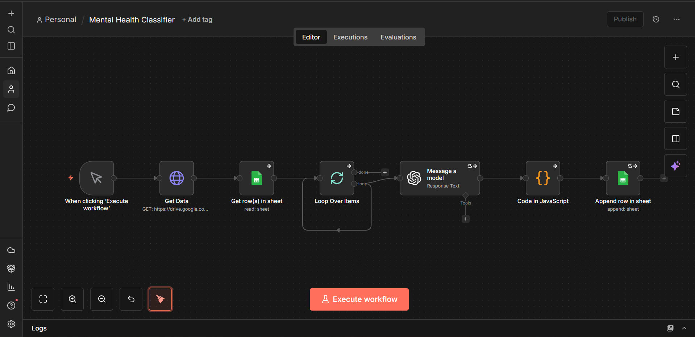

#  Reddit Mental Health Crisis Classifier

An automated n8n workflow that ingests Reddit posts from the [Dreaddit dataset](https://arxiv.org/abs/1911.00133), classifies each post by mental health crisis severity using GPT-3.5-Turbo, and logs results to Google Sheets for tracking and visualization in Looker.

---

##  What It Does

1. **Fetches** Reddit post data from Google Drive (Dreaddit training dataset)
2. **Reads** each row from a Google Sheet containing post text, subreddit, and user ID
3. **Batches** posts in groups of 5 to manage API rate limits
4. **Classifies** each post via the OpenAI API (GPT-3.5-Turbo) into one of three risk levels:
   - `HIGH` - immediate crisis language detected
   - `MODERATE` - signs of distress but not acute
   - `LOW` - minimal or no crisis indicators
5. **Appends** the original post data + crisis label to an output Google Sheet
6. **Visualizes** results in a Looker dashboard tracking risk distribution and repeat users

---

##  Tech Stack

| Tool | Purpose |
|------|---------|
| [n8n](https://n8n.io) | Workflow orchestration |
| OpenAI API (GPT-3.5-Turbo) | LLM-based text classification |
| Google Sheets | Input data source + output store |
| Google Drive | Raw dataset hosting |
| Looker | Dashboard & visualization |
| JavaScript (n8n Code node) | Response parsing and data merging |

---

##  Looker Dashboard

The output Google Sheet feeds a Looker dashboard with two views:

- **Risk Distribution** - bar chart showing record count per crisis level (HIGH / MODERATE / LOW)
- **Subreddit Activity** - breakdown of post volume by subreddit, with distinct user ID tracking to identify individuals seeking help multiple times

---

##  Workflow Structure



```
Manual Trigger
     HTTP Request (fetch dataset from Google Drive)
         Google Sheets (read input rows)
             Loop Over Items (batch size: 5)
                 OpenAI GPT-3.5-Turbo (classify message)
                     Code Node (merge original data + crisis_level)
                         Google Sheets (append results)
```

---

##  Input Data Schema

The input Google Sheet (`dreaddit-train`) expects the following columns:

| Column | Description |
|--------|-------------|
| `id` | Unique identifier for each post/user |
| `subreddit` | Subreddit the post came from |
| `post_id` | Reddit post ID |
| `sentence_range` | Sentence range extracted from post |
| `message` | The text content to be classified |

---

##  How to Run

### Prerequisites
- n8n instance (cloud or self-hosted)
- OpenAI API key
- Google account with Sheets & Drive access
- Looker account connected to Google Sheets

### Setup Steps

1. **Import the workflow** - In your n8n instance, go to *Workflows  Import* and upload `Mental_Health_Classifier.json`

2. **Configure credentials**
   - Add your **OpenAI API key** under *Credentials  OpenAI*
   - Connect your **Google Sheets OAuth2** account under *Credentials  Google Sheets*

3. **Set up your Google Sheets**
   - Create an input sheet matching the schema above (or use the Dreaddit dataset)
   - Create an output sheet - the workflow will append `crisis_level` alongside original columns

4. **Update Sheet IDs** in the workflow nodes to point to your own sheets

5. **Execute** - Click *Execute Workflow* to run manually, or add a schedule trigger for automation

---

##  Notes

- The OpenAI node is set to retry up to 2 times on failure
- Batching (size: 5) prevents API rate limit errors on large datasets
- The classifier prompt instructs the model to return only `HIGH`, `MODERATE`, or `LOW` - no extra text - for clean, parseable output
- Credentials in the JSON are account-specific and will need to be re-linked in your own n8n instance

---

##  Repository Contents

```
 Mental_Health_Classifier.json   # n8n workflow export
 README.md                       # This file
```

---

##  Author

**Aditi Neema**
